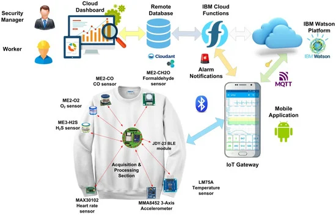
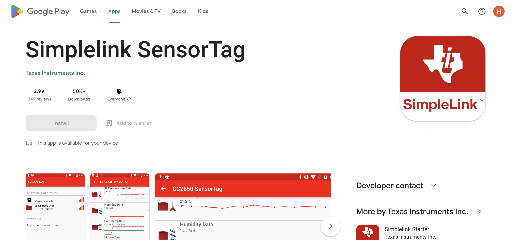

# Smart T-Shirt for Monitoring Thermal Comfort and  Physiological Parameters in Working Places
Wearable devices represent a versatile technology in the IoT, enabling non-invasive and accurate data collection directly from the human body.The development of a smart shirt to monitor working conditions in particularly dangerous workplaces. The wearable device integrates a wide set of sensors to locally acquire the user’s  signs (e.g., heart rate, and temperature).The acquired data are wirelessly sent to a cloud platform, where they are displayed, processed, and stored. A mobile application was deployed to gather data from the wearable devices and forward them toward the cloud application.

# System Architecture
The developed wearable device represents the source nodes of a monitoring system based on a cloud platform, which displays, processes, and stores the gathered data. The developed system enables remote monitoring of workers’ parameters and sends alarm notifications to users and companies’ security managers if abnormal parameters are detected. Furthermore, a mobile application was developed to gather data from wearable devices and forward the acquired data to the cloud platform through Message Queue Telemetry Transmission (MQTT), acting as a mobile IoT gateway.



# Setup
To run this project, install it locally using npm:
```
$ npm install
$ npm run start
```
To run the node server for login:

```
$ node server.js
```

Enter credentials:
```
user name: test
password: test1
```

# Mobile Application

Download the application from playstore "Simplelink SensorTag"



After install the application run it and connect with Ti SensorTag CC2650.

Note: If app is not run or crash. Do the steps below

1. Go to settings
2. Tap the USB debugging mode
3. Restart the app


